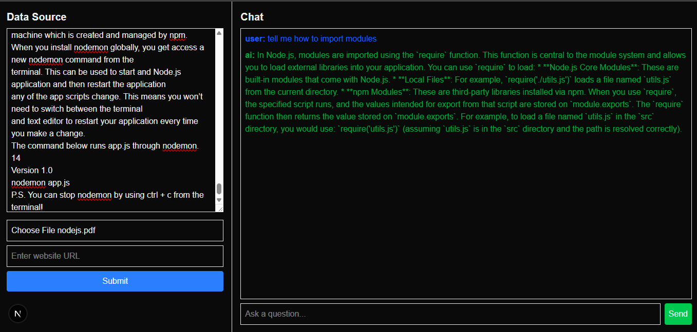

# NoteRAG
A Retrieval-Augmented Generation (RAG) web application built with Next.js, LangChain, Qdrant, and Google Gemini.

This application allows users to upload text, PDFs, or website URLs, store them as vector embeddings, and chat with the data using AI.



## 🚀 Features

- 📄 Upload raw text documents
- 📕 Upload PDF documents
- 🌐 Add website URLs for scraping
- ✂️ Automatic text chunking for optimal processing
- 🧠 Vector embeddings using Google Gemini
- 🗄️ Qdrant Cloud vector database for storage
- 🔍 Semantic search capabilities
- 💬 Interactive chat interface to query uploaded data
- ⚡ Built with Next.js App Router for modern performance


## 🛠️ Tech Stack

| Technology    | Usage                      |
| ------------- | -------------------------- |
| Next.js       | Fullstack framework        |
| LangChain     | RAG pipeline orchestration |
| Qdrant        | Vector database            |
| Google Gemini | LLM + Embeddings           |
| Cheerio       | Website scraping           |
| Formidable    | File uploads               |
| PDF-parse     | PDF text extraction        |
| TailwindCSS   | UI styling                 |

## 📁 Project Structure

```
noterag/
│
├── app/
│   ├── api/
│   │   ├── upload/
│   │   │   └── route.js
│   │   └── chat/
│   │       └── route.js
│   ├── globals.css
│   ├── layout.js
│   └── page.js
│
├── components/
│   └── (UI components)
│
├── public/
│   ├── readmeImg/
│   └── (static assets)
│
├── .env.local
├── package.json
├── next.config.mjs
├── tailwind.config.mjs
└── README.md
```

## 🚀 Installation

1. **Clone the repository**

   ```bash
   git clone https://github.com/apoorv654123/NoteRag.git
   cd NoteRag
   ```

2. **Install dependencies**

   ```bash
   npm install
   ```

3. **Set up environment variables**

   Create a `.env.local` file in the root directory:

   ```env
   GOOGLE_API_KEY=your_google_gemini_api_key
   QDRANT_URL=https://your-qdrant-cluster-url
   QDRANT_API_KEY=your_qdrant_api_key
   ```

4. **Run the development server**

   ```bash
   npm run dev
   ```

5. **Open in browser**
   ```
   http://localhost:3000
   ```

## 🔮 Future Improvements

- 🔐 User authentication and authorization
- 📊 File management dashboard
- ⚡ Streaming AI responses for better UX
- 📚 Multiple document collections/namespaces
- 🎯 Source highlighting in responses
- 📱 Mobile-responsive design enhancements
